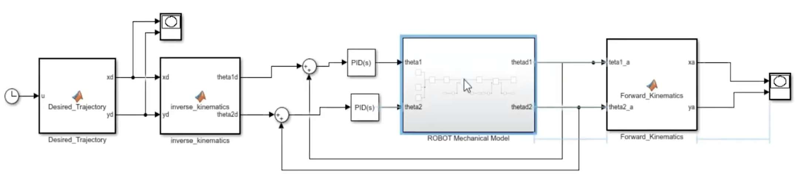
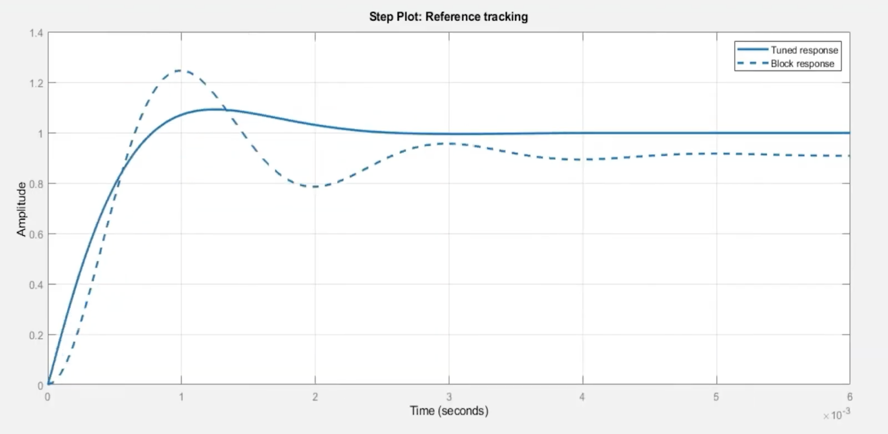
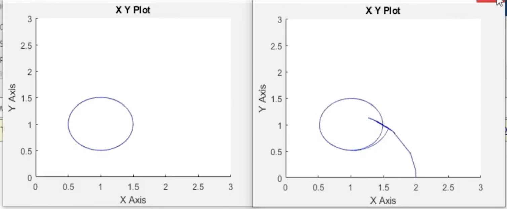
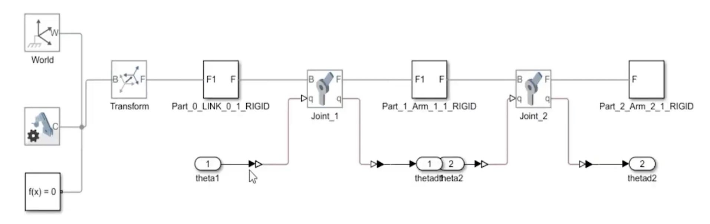

# 2-Link Robotic Arm Simulation (SolidWorks & MATLAB/Simulink)

This project details the complete workflow of designing, modeling, and controlling a 2-link planar robotic arm. It bridges the gap between CAD design (SolidWorks) and Control Systems engineering (MATLAB/Simulink) using the Simscape Multibody environment.

---

## Simulation Demo


**Figure 1:** Final trajectory tracking of the robotic arm in Simscape Mechanics Explorer.  
This confirms that the end-effector follows the commanded trajectory smoothly.

---

# Project Overview

The primary objective is to implement a closed-loop control system where the robot's end-effector follows a defined path (circle, ellipse, figure-8, or line).

**Workflow Summary:**
- **Modeling:** Build the robot links in SolidWorks  
- **Exporting:** Convert the SolidWorks assembly to Simscape XML  
- **Kinematics:** Forward & inverse kinematics implementation  
- **Control:** PID tuning for joint-level tracking  
- **Analysis:** Visualize end-effector tracking, errors, and joint dynamics  

---

# Mechanical Modeling (SolidWorks)

The robotic arm consists of:
- A ground-fixed base
- Link 1
- Link 2
- Two revolute joints

---

## ROBOT Simulation view


### Component List

| Component       | Description                                       |
|-----------------|---------------------------------------------------|
| **Link 0**      | Fixed base (grounded in simulation)               |
| **Link 1**      | First arm link, rotates about Joint 1             |
| **Link 2**      | Second arm link, rotates about Joint 2            |

---

# Mathematical Modeling

## Forward Kinematics

$$
x = L_1 \cos(\theta_1) + L_2 \cos(\theta_1 + \theta_2)
$$

$$
y = L_1 \sin(\theta_1) + L_2 \sin(\theta_1 + \theta_2)
$$


# Control System Architecture

The system uses a closed-loop feedback controller.

## Simulink Block Diagram



**Explanation:**  
This diagram shows:
- Desired trajectory block  
- IK computation  
- PID controllers  
- Simscape mechanical model  
- Forward kinematics  
- Feedback loop  

This is the complete high-level control pipeline.

---

# PID Tuning Parameters

| Joint | P   | I   | D   | N   |
|-------|-----|-----|-----|-----|
| 1     | 150 | 50  | 10  | 100 |
| 2     | 120 | 30  | 8   | 100 |

---

# File Structure

```
/2-link-arm-simulation
|
+-- /solidworks
| |-- Part_0_Link_0.SLDPRT
| |-- Part_1_Arm_1.SLDPRT
| |-- Part_2_Arm_2.SLDPRT
| +-- ROBOTIC_ARM_ASSEMBLY.SLDASM
|
+-- /matlab
|-- ROBOTIC_ARM_ASSEMBLY.xml
|-- ROBOTIC_ARM_ASSEMBLY.slx
|-- forward_kinematics.m
|-- inverse_kinematics.m
|-- desired_trajectory.m
+-- setup_simulation.m
```

---

# Simulation Results

## 1. Step Response (Reference Tracking)


**Explanation:**  
Shows tuned PID vs. block response.  
The tuned controller:
- Reduces overshoot  
- Reduces settling time  
- Adds stability and smoothness  

---

## Desired vs Actual Trajectory graphs




**Explanation:**  
The robot follows the target path closely. Minor deviations are due to inertia and PID tuning.

---

## 3. Simscape Mechanical Plant



**Explanation:**  
Displays the imported CAD model converted into Simscape rigid bodies connected by revolute joints. This block computes real dynamics (mass, inertia, motion).

---

# How to Run

## Step 1 — Build the Arm in SolidWorks  
1. Create Link 0 (Base)  
2. Create Link 1  
3. Create Link 2  
4. Assemble them with *revolute mates*  
5. Export using:  
   `Tools → Simscape Multibody → Export → XML + STEP`

This produces the `.xml` file used in MATLAB.

---

## Step 2 — Clone the Repository

```bash
git clone https://github.com/yourusername/2-link-arm-simulation.git
